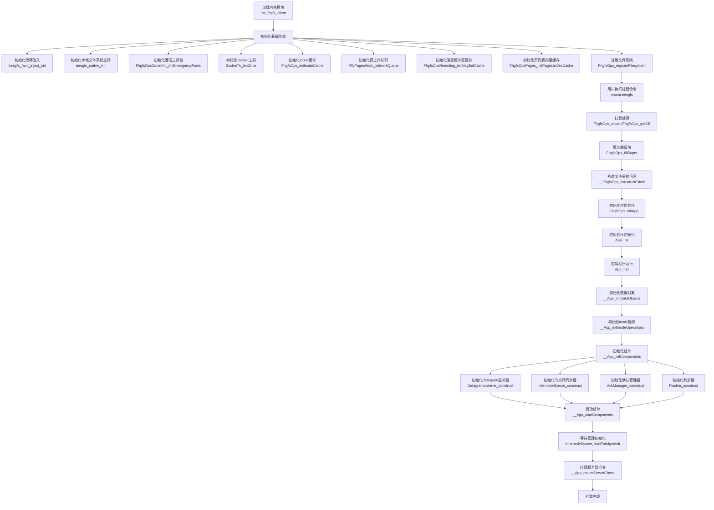

# BeeGFS客户端模块初始化流程图

本图描述了BeeGFS客户端内核模块从加载到挂载完成的整个初始化流程。

## 流程说明

1. **模块加载阶段**：初始化基础功能并注册文件系统类型
   - 初始化故障注入、缓存、消息缓冲区等基础设施
   - 向Linux内核注册BeeGFS文件系统类型

2. **挂载阶段**：用户执行挂载命令后的处理
   - 处理挂载请求并填充超级块
   - 构造文件系统信息
   - 初始化并运行客户端应用程序

3. **应用程序初始化阶段**：
   - 初始化数据对象（配置、日志记录、网络等）
   - 初始化inode操作（与VFS的接口）
   - 初始化和启动各种功能组件

4. **连接与验证阶段**：
   - 等待管理服务初始化
   - 执行挂载服务器检查，验证连接
   - 完成挂载并准备好处理文件系统操作 