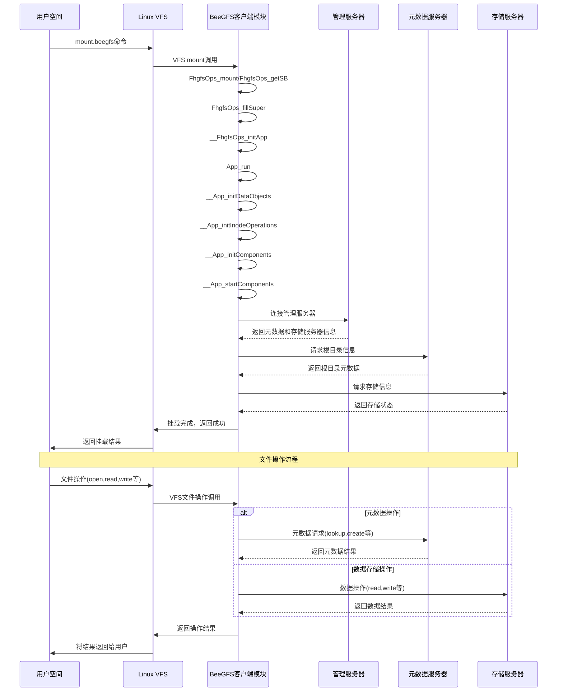

# BeeGFS客户端挂载和文件操作时序图

本图描述了BeeGFS客户端内核模块的挂载流程以及后续文件操作处理流程。

## 时序流程说明

### 挂载阶段

1. **用户发起挂载**：用户通过`mount.beegfs`命令发起挂载请求
2. **VFS处理**：Linux VFS接收挂载请求并调用已注册的BeeGFS挂载处理函数
3. **客户端初始化**：
   - 填充超级块信息
   - 初始化应用程序及其组件
   - 启动网络通信和同步组件
4. **服务器连接**：
   - 连接到管理服务器获取集群配置
   - 获取元数据和存储服务器信息
   - 进行挂载检查，验证基本功能
5. **挂载完成**：向VFS和用户空间返回挂载结果

### 文件操作阶段

1. **用户发起操作**：用户通过标准文件系统调用（open/read/write等）发起请求
2. **VFS路由**：Linux VFS将操作路由到BeeGFS客户端的相应处理函数
3. **客户端处理**：
   - 对于元数据操作（lookup/create/mkdir等）：请求发送至元数据服务器
   - 对于数据操作（read/write）：请求发送至存储服务器
4. **结果返回**：操作结果通过VFS层返回给用户空间

## 关键组件交互

- **客户端与管理服务器**：获取集群配置和服务器拓扑信息
- **客户端与元数据服务器**：处理文件/目录的创建、查找、属性管理等
- **客户端与存储服务器**：处理文件数据的读取和写入操作 