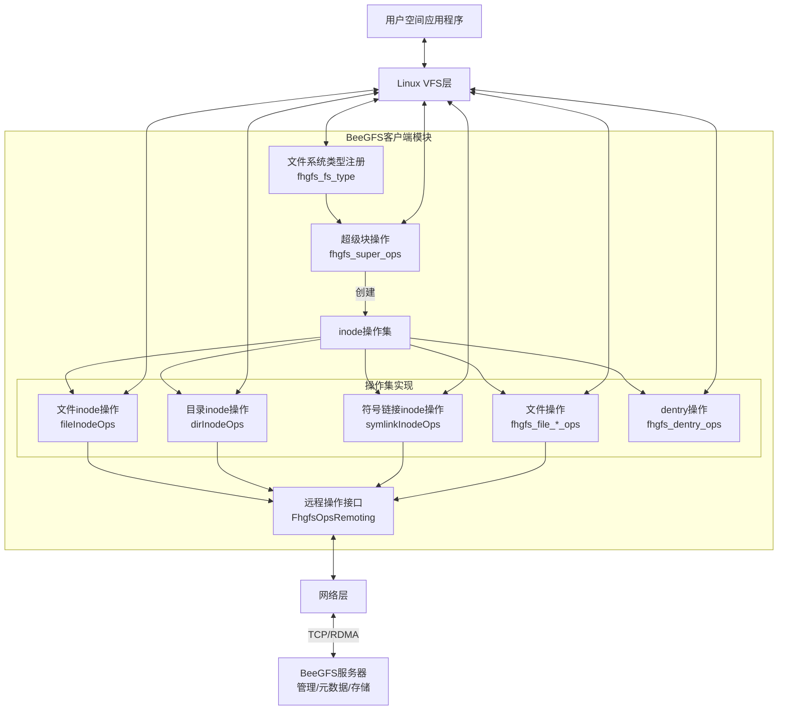

# BeeGFS客户端与Linux VFS集成架构

本文档描述了BeeGFS客户端内核模块如何与Linux虚拟文件系统(VFS)集成，并实现文件系统功能。

## 架构图



## VFS接口实现

BeeGFS客户端通过实现以下操作结构体，将自身功能与Linux VFS集成：

### 1. 文件系统类型（`fhgfs_fs_type`）

```c
static struct file_system_type fhgfs_fs_type = {
   .name       = BEEGFS_MODULE_NAME_STR,
   .owner      = THIS_MODULE,
   .kill_sb    = FhgfsOps_killSB,
   .mount      = FhgfsOps_mount,
};
```

### 2. 超级块操作（`fhgfs_super_ops`）

```c
static struct super_operations fhgfs_super_ops = {
   .statfs        = FhgfsOps_statfs,
   .alloc_inode   = FhgfsOps_alloc_inode,
   .destroy_inode = FhgfsOps_destroy_inode,
   .drop_inode    = generic_drop_inode,
   .put_super     = FhgfsOps_putSuper,
   .show_options  = FhgfsOps_showOptions,
};
```

### 3. 文件Inode操作（`fileInodeOps`）

关键操作：
- getattr/setattr：获取/设置文件属性
- permission：权限检查
- 扩展属性操作：getxattr/setxattr/listxattr
- ACL操作（可选）：get_acl/set_acl

### 4. 目录Inode操作（`dirInodeOps`）

关键操作：
- lookup：查找目录项
- create/mkdir/rmdir：创建/删除文件和目录
- link/unlink：创建/删除硬链接
- symlink：创建符号链接
- rename：重命名文件或目录

### 5. 文件操作（`fhgfs_file_*_ops`）

BeeGFS提供三种文件操作模式：
- `fhgfs_file_native_ops`：原生模式，直接IO
- `fhgfs_file_pagecache_ops`：页缓存模式
- `fhgfs_file_buffered_ops`：缓冲模式

关键操作：
- open/release：打开/关闭文件
- read/write：读写文件数据
- flush/fsync：刷新文件内容
- mmap：内存映射支持

### 6. 目录操作（`fhgfs_dir_ops`）

关键操作：
- readdir：读取目录内容
- llseek：移动目录指针

### 7. dentry操作（`fhgfs_dentry_ops`）

关键操作：
- d_revalidate：验证dentry有效性
- d_release：释放dentry资源
- d_automount：自动挂载点支持

## 与VFS的交互流程

1. **文件系统注册**：模块加载时，通过`register_filesystem(&fhgfs_fs_type)`向Linux内核注册BeeGFS文件系统类型
2. **挂载处理**：用户执行挂载命令时，内核调用BeeGFS的`mount`操作函数，初始化超级块和根inode
3. **文件操作拦截**：VFS将针对BeeGFS文件系统的操作转发给对应的操作函数集
4. **远程操作转换**：客户端操作函数将VFS请求转换为BeeGFS协议消息，通过网络发送至服务器
5. **结果处理**：从服务器接收响应后，将结果转换回VFS期望的格式并返回

## 缓存模式与性能优化

BeeGFS客户端提供三种缓存模式以适应不同场景：

1. **原生模式**：直接IO，绕过内核页缓存，适用于有自己缓存机制的应用程序
2. **页缓存模式**：利用Linux内核页缓存，提供标准文件系统体验
3. **缓冲模式**：实现自定义缓冲逻辑，针对BeeGFS网络特性优化

根据配置选择不同的文件操作函数集，影响文件的读写缓存行为：

```c
if(Config_getTuneFileCacheTypeNum(cfg) == FILECACHETYPE_Native)
{
    inode->i_fop = &fhgfs_file_native_ops;
    inode->i_data.a_ops = &fhgfs_addrspace_native_ops;
}
else if(Config_getTuneFileCacheTypeNum(cfg) == FILECACHETYPE_Paged)
{
    inode->i_fop = &fhgfs_file_pagecache_ops;
    inode->i_data.a_ops = &fhgfs_address_pagecache_ops;
}
else
{
    inode->i_fop = &fhgfs_file_buffered_ops;
    inode->i_data.a_ops = &fhgfs_address_ops;
} 